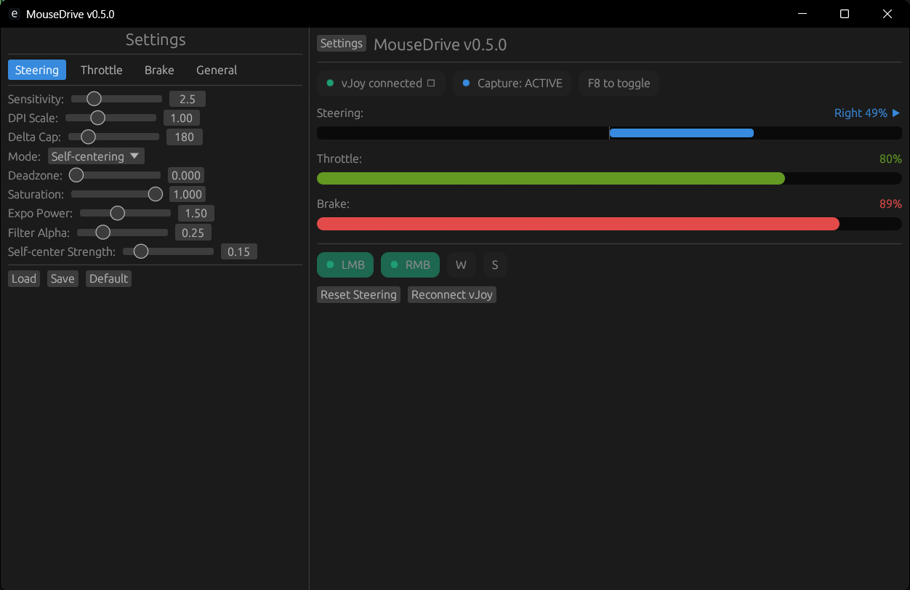

# MouseDrive (Rust) — v0.5.0

[](#requirements)
[](#build)
[](LICENSE)
[](https://app.fossa.com/projects/git%2Bgithub.com%2FToxpox%2FMouseDrive?ref=badge_shield)

MouseDrive is a Windows application that converts mouse and keyboard input into virtual joystick signals via [vJoy](https://github.com/BrunnerInnovation/vJoy), designed for racing simulators.

[Old C++ version](https://github.com/Toxpox/MouseDrive-old-cpp)

<p align="center">
  
</p>

## Download

**[Download latest release](https://github.com/Toxpox/MouseDrive/releases/latest)**

Or browse all versions at [Releases](https://github.com/Toxpox/MouseDrive/releases/).

> Extract the `.zip`, place `vJoyInterface.dll` next to `mousedrive.exe`, and run.

## Features

- **Steering** — Mouse X movement mapped to vJoy X axis with 4 modes (linear, expo*, filtered*, self-centering)
- **Throttle** — Left mouse button with graphical rise/fall envelope curves
- **Brake** — Right mouse button with full state machine (press, hold, progressive trail-off, release)
- **Graphical curve editors** — Drag-point envelope editors (2–8 points, linear or smooth/monotone-cubic) for throttle rise/fall, brake apply, and brake post-hold drop, with presets and a live marker
- **Gear buttons** — W/S keys mapped to vJoy buttons 1/2
- **Live dashboard** — Colour-coded vertical gauges (throttle green / brake red) and a bidirectional steering bar; real-time status and input indicator pills
- **Tabbed settings panel** — Collapsible side panel with per-category tuning
- **Config persistence** — TOML-based config with load/save/reset
- **Auto-update** — Background check against GitHub releases with one-click self-update (download → SHA-256 verify → replace → restart)
- **Raw input capture** — Works even when the window is not focused (F8 toggle)
- **Lock-free architecture** — Atomic globals between raw input thread and GUI thread
- **Language support** — Turkish and English UI (switchable in Settings > General)

> *Experimental

## Input / Output mapping

| Input | vJoy Output | Control |
|-------|-------------|---------|
| Mouse X movement | X Axis | Steering |
| Left mouse button (held) | Y Axis | Throttle |
| Right mouse button (held) | Rz Axis | Brake |
| W key | Button 1 | Gear up |
| S key | Button 2 | Gear down |
| Middle click | — | Reset steering |
| F8 | — | Toggle input capture |

## Quick start

1. Install [vJoy](https://github.com/BrunnerInnovation/vJoy) and create a device with **X / Y / Rz** axes and **2 buttons** enabled (Device 1).
2. `vJoyInterface.dll` is searched automatically (exe directory → Program Files → PATH).
3. Run [Executable MouseDrive](https://github.com/Toxpox/MouseDrive/releases/latest).
4. Bind your game to the vJoy device axes.

## How it works

- **Raw input thread** — Dedicated thread with a hidden window that receives `WM_INPUT` messages for mouse deltas and button states.
- **Atomic communication** — `AtomicI64`, `AtomicBool`, `AtomicU64` + `Mutex<Snapshot>` for zero-lock data transfer between threads.
- **Control thread** — Dedicated `THREAD_PRIORITY_HIGHEST` 250 Hz loop (`control.rs`) that owns the vJoy handle. The axis feed never stalls on window minimize or repaint lag.
- **GUI thread** — eframe/egui loop that reads the shared snapshot for gauges/indicators and publishes config changes; repaint-lazy (~60 Hz focused, ~4 Hz backgrounded).

## Requirements

- Windows 10/11
- [Executable MouseDrive](https://github.com/Toxpox/MouseDrive/releases/latest)
- [vJoy Driver**](https://github.com/BrunnerInnovation/vJoy) installed and enabled
- `vJoyInterface.dll` available (next to exe, Program Files, or in `PATH`)

>  ** Tested with V2.2.2.0

## Build

```powershell
cargo build

cargo build --release
```


## Configuration

Settings are stored in TOML format. The config file is loaded from:

1. `<exe_directory>/config.toml` (portable mode)
2. `%APPDATA%\MouseDrive\config.toml` (standard)

Use the **Save** / **Load** / **Default** buttons in the settings panel, or edit the file manually.

## Project layout

```
MouseDrive/
├── src/
│   ├── main.rs          # App struct, entry point, vJoy connection
│   ├── config.rs        # Config struct, TOML load/save, path resolution
│   ├── input.rs         # Raw input thread, atomic globals, key helpers
│   ├── logic.rs         # Steering/throttle/brake state machine & math
│   ├── curve.rs         # Envelope curve model (PCHIP eval/inverse, presets)
│   ├── curve_editor.rs  # Interactive drag-point egui curve widget
│   ├── ui.rs            # egui UI (side panel, tabs, dashboard)
│   ├── update.rs        # GitHub update check + one-click self-update
│   ├── lang.rs          # TR/EN localization strings
│   └── vjoy.rs          # vJoy FFI (runtime DLL loading, axis/button API)
├── Cargo.toml
├── LICENSE
└── README.md
```

Design notes for the curve editors and the updater live in `graph.md` and
`auto-update.md`; the UI redesign spec is in `UImake.md`; the feature/performance
roadmap is in `todo1.md`; release history in [CHANGELOG.md](CHANGELOG.md).

## Troubleshooting

| Problem | Solution |
|---------|----------|
| "vJoyInterface.dll not found" | Place the DLL next to the exe, in `Program Files\Shaul\vJoy\x64`, or add its folder to `PATH` |
| "vJoy not enabled" | Check that vJoy driver is installed and the service is running |
| "vJoy device busy" | Another application is using Device 1 — close it or use a different device |
| Mouse not captured | Press **F8** to toggle input capture |
| Settings not saving | Check write permissions in `%APPDATA%\MouseDrive\` |

## License

Copyright (c) 2025-2026 [Toxpox](https://github.com/Toxpox).
This project is licensed under the [MIT License](https://github.com/Toxpox/MouseDrive/blob/main/LICENSE).

[](https://app.fossa.com/projects/git%2Bgithub.com%2FToxpox%2FMouseDrive?ref=badge_large)
